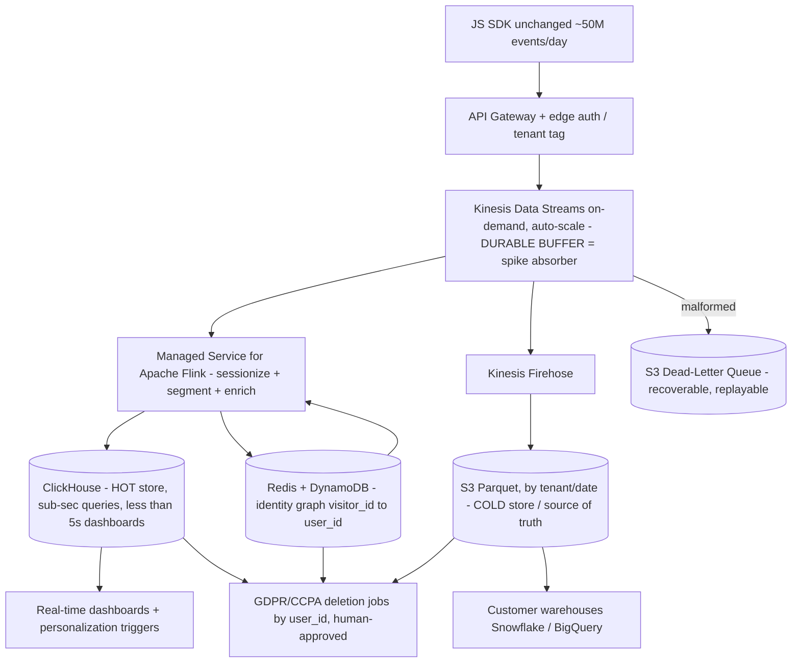

# Architecture Diagram — Real-Time Analytics Pipeline



## ASCII fallback

```
JS SDK (unchanged, ~50M/day)
        |
   API Gateway  --(tenant tag, auth)-->
        |
   Kinesis Data Streams (on-demand)  <== DURABLE BUFFER: absorbs 10x spikes, replay source
        |
        |-- malformed --> S3 Dead-Letter Queue (recoverable, replayable)
        |
        |--> Kinesis Firehose --> S3 (Parquet, COLD, source of truth) --> Customer warehouses (Snowflake/BigQuery)
        |                                    |
        |                                    +--> GDPR/CCPA deletion jobs
        |
   Managed Flink (sessionize / segment / enrich)
        |   ^
        |   |  (reads identity back to stitch sessions)
        |   +--- Redis + DynamoDB (identity graph: visitor_id -> user_id) --> GDPR deletion
        |
        |--> ClickHouse (HOT, <5s dashboards) --> Real-time dashboards + personalization
                                              +--> GDPR/CCPA deletion jobs
```